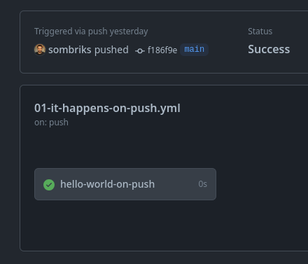

# My gh-actions playground

Small examples of interesting GitHub actions combinations.

## How to run this playground

Most workflows where intentionally left with `workflow_dispatch` so they don't
run by accident on every commit. Not as if it was a big issue, since they do
_mostly nothing_ by design.

But you can also run them using the [act][0] command line tool, which emulates
the GitHub actions environment in a quite near the real thing way.

So, the three big ways to run a workflow:

- Visit [the actions page][1] and run them by hand
- Use the [GitHub CLI][2]: `gh workflow run .github/workflow/00-hello-world.yml`
- Use act: `act -W .github/workflows/00-hello-world.yml`

## Overview

GitHub Actions is what happens when yaml and bash decide to have a child.

The workflow files are used to common integration routines: run tests, check the
quality of code, perform any chore that can be automatized, scripted.

## Workflow file syntax

Each workflow file must define:

- _name_ (unique across all workflows)
- _on_ (event)
- _jobs_ (actual work)

### Events

What could possibly trigger an workflow

- You hit a button
- A git push or something
- Another workflow

More possibilities [here][3].

### Jobs

- Give cool names to your jobs, not just _build_
- One workflow can house several jobs
- Jobs will run in **parallel** unless you do something about it
  - make jobs `needs` other jobs

More details [here][4].

## 00 - [smallest possible][5]

- [Manual dispatch][6]
- [Echoes 'hello world'][7]

![image-manual-dispatch.png][8]

## 01 - [occurs on every git push or merge][9]

- The 101 of CI
- [Echoes 'hello word from _some branch_'][10]

## 02 - [have two jobs][11]

- Remember, runs in **parallel**!

## 03 - have two jobs but in sequence

## 04 - make one job use another

## 05 - jobs inputs

## 06 - jobs outputs

## 07 - environment variables

## 08 - secrets

## 09 - steps

## 10 - use 3rd actions

## 11 - noteworthy actions

## 12 - writing good CI/CD pipelines

[0]: https://github.com/nektos/act?tab=readme-ov-file#installation-through-package-managers
[1]: https://github.com/sombriks/gh-actions-playground/actions
[2]: https://cli.github.com/
[3]: https://docs.github.com/en/actions/using-workflows/events-that-trigger-workflows
[4]: https://docs.github.com/en/actions/using-jobs/using-conditions-to-control-job-execution
[5]: .github/workflows/00-hello-world.yml
[6]: https://github.com/sombriks/gh-actions-playground/actions/workflows/00-hello-world.yml
[7]: https://github.com/sombriks/gh-actions-playground/actions/runs/7162121699/job/19498652966#step:2:5
[8]: imgs/image-manual-dispatch.png
[9]: .github/workflows/01-it-happens-on-push.yml
[10]: https://github.com/sombriks/gh-actions-playground/actions/runs/7162222469/job/19498893130#step:2:5
[11]: .github/workflows/02-two-jobs.yml
[12]:
[13]:
[14]:
[15]:
[16]:
[17]:
[18]:
[19]:
[20]:
