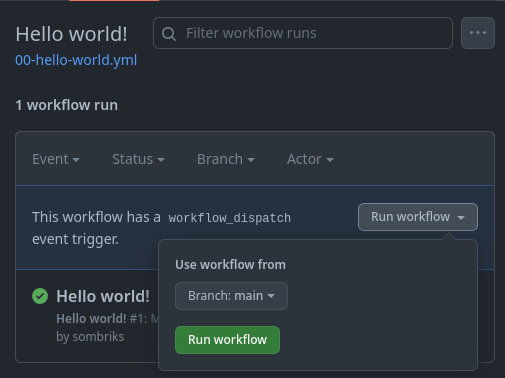

# My gh-actions playground

Small examples of interesting github actions combinations.

## Overview

GitHub Actions is what happens when yaml and bash decide to have a child.

Each workflow file must define:

- _name_ (unique across all workflows)
- _on_ (event)
- _jobs_ (actual work)

### Events

What could possibly trigger an workflow

- You hit a button
- A git push or something
- Another workflow

More possibilities [here](https://docs.github.com/en/actions/using-workflows/events-that-trigger-workflows).

### Jobs

- Give cool names to your jobs, not just _build_
- One workflow can hold several jobs
- Jobs will run in **parallel** unless you do something about it
  - make jobs `needs` other jobs

More details [here](https://docs.github.com/en/actions/using-jobs/using-conditions-to-control-job-execution).

## 00 - [smallest possible](.github/workflows/00-hello-world.yml)

- [Manual dispatch](https://github.com/sombriks/gh-actions-playground/actions/workflows/00-hello-world.yml)
- [Echoes 'hello world'](https://github.com/sombriks/gh-actions-playground/actions/runs/7162121699/job/19498652966#step:2:5)
- Amazingly useless

## 01 - [occurs on every git push or merge](.github/workflows/01-it-happens-on-push.yml)

- The 101 of CI
- [Quite useless](https://github.com/sombriks/gh-actions-playground/actions/runs/7162222469/job/19498893130#step:2:5)

## 02 - have two jobs

## 03 - have two jobs but in sequence

## 04 - make one job use another

## 05 - jobs inputs

## 06 - jobs outputs

## 07 - environment variables

## 08 - secrets

## 09 - steps

## 10 - use 3rd actions

## 11 - noteworthy actions

## 12 - writing good CI/CD pipelines
